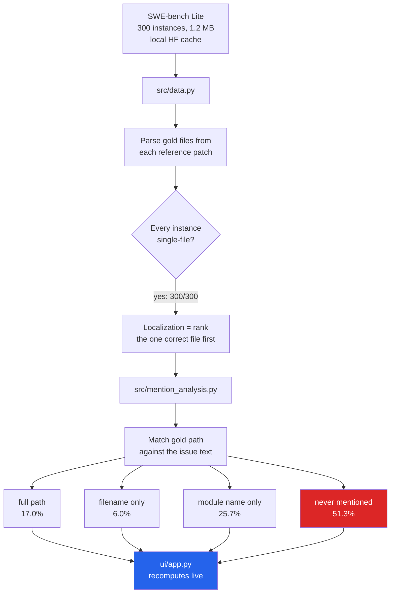

# swebench-localization

**Over half of SWE-bench Lite never names the file you have to fix.**

SWE-bench is reported as one number, but solving an instance requires two different
things: **find the file**, then **write the patch**. A single score cannot tell you which
one failed. This repo measures the first half — and finds that for **51.3% of instances
the gold file is never mentioned in the issue text at all**: not the path, not the
filename, not even the module name.

A model that fails those has not failed at *reasoning about code*. It has failed at
*search*. Those are different problems with different fixes, and the benchmark's headline
number hides the distinction.

---

## Measured result

All 300 instances of `princeton-nlp/SWE-bench_Lite` (test split). Every instance is a
**single-file fix**, so localization is exactly "rank the one correct file first".

### How the gold file is referenced in `problem_statement`

| Tier | Instances | Share |
|---|---|---|
| Full path given verbatim | 51 | **17.0%** |
| Filename only | 18 | 6.0% |
| Module name only | 77 | 25.7% |
| **Never mentioned** | **154** | **51.3%** |

### Adding `hints_text` changes the task

| Tier | issue only | + hints |
|---|---|---|
| Full path | 17.0% | **33.0%** |
| Never mentioned | **51.3%** | **38.0%** |

`hints_text` is discussion from the issue thread. Including it nearly doubles the share of
instances where the file is handed to you. **Results that use hints are not comparable to
results that don't** — and papers do not always say which they used.

### The aggregate score hides a repository effect

| Repo | n | never mentioned |
|---|---|---|
| sphinx-doc/sphinx | 16 | **87.5%** |
| psf/requests | 6 | 66.7% |
| pylint-dev/pylint | 6 | 66.7% |
| pytest-dev/pytest | 17 | 58.8% |
| django/django | 114 | 54.4% |
| sympy/sympy | 77 | 48.1% |
| scikit-learn/scikit-learn | 23 | 47.8% |
| pydata/xarray | 5 | 40.0% |
| pallets/flask | 3 | 33.3% |
| matplotlib/matplotlib | 23 | 30.4% |
| mwaskom/seaborn | 4 | 25.0% |
| astropy/astropy | 6 | **16.7%** |

Localization difficulty ranges from **16.7% to 87.5%** depending on the repository, and
`django/django` alone is 38% of the benchmark. An aggregate SWE-bench score is therefore
partly a measurement of **which repositories the benchmark happens to contain**.

---

## Why this matters

`mcp-lab/projects/04_swebench` failed on a 3B model, and the assumption was that a larger
model would fix it. This reframes that: before attributing failure to model size, establish
how much of it was ever a *retrieval* problem. For 154 of 300 instances, no amount of code
reasoning helps until the right file has been found.

It also makes the pending 3B-vs-14B comparison far more informative — you will be able to
say **which half** the bigger model improved.

---

## Reproduce

```bash
python src/data.py              # dataset integrity + gold file extraction
python src/mention_analysis.py  # the numbers in this README
streamlit run ui/app.py         # interactive dashboard
```

Every number above is produced by the code in this repo. The dashboard recomputes them
live from the same functions — nothing is hard-coded, and the `hints_text` toggle and
repository filter re-derive the whole report.

## Method

- **Gold files** are parsed from each instance's reference patch (`+++ b/<path>` lines in
  the unified diff), not from any model output.
- **Matching is exact**: full-path substring, then basename substring, then a
  word-boundary regex on the module stem, so `separable` does not match inside
  `inseparable`.
- **Deterministic.** No model, no embeddings, no random seed — the same input always gives
  the same table.

## Status

✅ **Phase 1 complete** — benchmark discoverability measured.

🔴 **Phase 2 not started** — retrieval baselines (BM25 vs embeddings vs LLM-as-locator)
scored as recall@k against the repository file list. This needs each repo's file tree at
its `base_commit`, obtainable via the GitHub API trees endpoint (paths only, no file
contents, so the download is small). *Blocked at time of writing: the API call timed out
on a saturated connection.*

## Data

`princeton-nlp/SWE-bench_Lite`, test split, 300 instances, read from the local Hugging Face
cache (1.2 MB — no download required). See `data/sources.json`.

## References

- Jimenez, C. E., Yang, J., Wettig, A., Yao, S., Pei, K., Press, O., & Narasimhan, K.
  **SWE-bench: Can Language Models Resolve Real-World GitHub Issues?**
  *ICLR 2024.*

⚠️ Citation written from the standard reference — **confirm against the paper before
relying on it.**

---

## How it works



The matching is a strict ladder - full path, then basename, then a word-boundary regex
on the module stem - so each instance lands in exactly one tier and the strongest form
present always wins.

---

## Problems hit while building this

| Problem | What happened | Fix |
|---|---|---|
| **Hardcoded cache path** | `data.py` pointed at an absolute `C:\Users\...` path, so a clone worked on exactly one machine | Resolve `HF_HUB_CACHE` then `HF_HOME/hub` then the platform default at call time, with a download fallback and an error naming every path searched |
| **CI failed on the first push** | `setup-uv` defaults its cache to a `**/uv.lock` glob and **errors out** when nothing matches - not a cache miss, a hard failure. No lock file is committed here | Keyed the cache on `pyproject.toml` |
| **Lint drift would have broken CI** | `ruff` found 4 errors and 4 unformatted files before the first push | Ran `ruff check --fix` and `ruff format` before pushing; pinned ruff to a minor range so the formatter cannot change under the build |
| **Substring matching overcounted** | `separable` matched inside `inseparable`, inflating the "module name only" tier | Word-boundary regex, with a test asserting the `inseparable` case |
| **Phase 2 blocked** | The GitHub trees API call timed out while fetching repo file lists | Recorded as explicitly not-done rather than estimated |

---

## Future work

1. **Phase 2 - actual retrieval scoring.** Fetch each repo's file tree at its
   `base_commit` via the GitHub trees API (paths only, no contents, so the download stays
   small) and score **BM25 vs embeddings vs LLM-as-locator** as recall@k. **BM25 may well
   win** - if it does, that is the finding.
2. **Condition patch validity on localization.** The number that matters is *given the
   right file was found, how often is the patch right?* - that separates retrieval
   failure from reasoning failure cleanly.
3. **Extend to full SWE-bench** (2,294 instances) to check whether Lite's
   100%-single-file property distorts the picture.
4. **Correlate difficulty with issue length** - long prose naming no file is likely the
   hardest tier, and that is testable.
5. **Report per-repo scores by default** in any SWE-bench evaluation, given the
   16.7%-87.5% spread measured here.

---

## Stack

`Python 3.11+` · `pandas` · `pyarrow` · `Streamlit` · `Altair` · `pytest` · `ruff` ·
`GitHub Actions` · dataset via `Hugging Face Hub`

## Keywords

SWE-bench · SWE-bench Lite · bug localization · fault localization · code retrieval ·
LLM benchmark · benchmark evaluation · benchmark contamination · retrieval vs reasoning ·
automated program repair · issue-to-file mapping · coding agent evaluation ·
AI software engineering · LLM evaluation harness · reproducible benchmarks · BM25

## Layout

```
src/data.py               load from HF cache, parse gold files from patches
src/mention_analysis.py   discoverability tiers + per-repo breakdown
ui/app.py                 Streamlit dashboard (recomputes everything live)
data/sources.json         provenance
```
